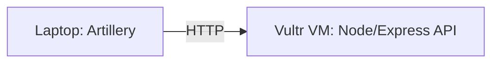

# QA Performance Practice Project

A local API you fully control, built to practice three things at once:
**SQL (JOIN + UPDATE validation)**, **Redis caching**, and **Artillery load testing** —
all three map directly to gaps/requirements from the backend QA role you're applying to.

This project also includes a **distributed load testing investigation**: an
earlier same-machine load test produced failures that looked suspiciously
like local resource contention rather than real application problems. To
verify that, the app was deployed to a separate cloud VM and re-tested from
a laptop — see [Distributed Load Testing](#distributed-load-testing) below
for the full writeup and findings.

Verified working: builds clean with `npm run build`, and manual smoke tests confirmed
`/users`, `/users/:id` (cache MISS→HIT), `/login` → `/profile` (JWT chain), and the
JOIN preview endpoint all return correct results.

## Setup

```bash
npm install
npm run build
npm start
```

Server runs at `http://localhost:3000`. By default it uses an **in-memory cache**
(no Redis server required) so you can run it standalone immediately.

### To practice against real Redis (recommended before your interview)

```bash
docker run -p 6379:6379 redis
USE_REAL_REDIS=true npm start
```

Now `GET /users/:id` is genuinely backed by Redis. Try:
- `redis-cli KEYS '*'` to see cached keys
- `redis-cli TTL user:5` to watch the 30s expiry count down
- Comment out the `cache.del(...)` line in `src/index.ts`'s `PUT /users/:id`
  handler, restart, and reproduce the stale-cache bug from Scenario 1 in
  the refresher doc on purpose — then put the fix back and confirm it's resolved.

## Endpoints

| Method | Path | Purpose |
|---|---|---|
| POST | `/login` | Returns a JWT for a given `userId` |
| GET | `/users` | List all users (uncached — baseline load target) |
| GET | `/users/:id` | Single user (cached, 30s TTL — watch `X-Cache: MISS`/`HIT` header) |
| PUT | `/users/:id` | Update email + invalidate cache (demonstrates correct invalidation) |
| GET | `/profile` | Requires `Authorization: Bearer <token>` — for the login→auth-flow scenario |
| POST | `/orders` | Create an order (stateful write, good POST load target) |
| GET | `/admin/preview-flag-orders` | SELECT preview of the JOIN — see which rows *would* be affected |
| POST | `/admin/run-flag-orders` | Runs the actual JOIN+UPDATE in a transaction, returns rows changed |

## SQL practice (JOIN + UPDATE scoping)

The pattern in `src/db.ts` (`previewFlagQuery` / `runFlagUpdate`) mirrors exactly
what you described doing at Shopee: validating an UPDATE-with-JOIN-and-filter
against mock data before it ships.

Try this:
1. `curl http://localhost:3000/admin/preview-flag-orders` — see which rows would be affected
2. Deliberately loosen the JOIN in `db.ts` (e.g., remove the region filter) and
   re-run the preview — watch the row count balloon. This is the exact bug
   pattern from Scenario 4 in the refresher doc.
3. Put the filter back, confirm the row count returns to expected.

## Load testing with Artillery

Two scenarios are included in `artillery/`:

- **`basic-load.yml`** — ramping load against `/users`, `/users/:id`, `/orders`
- **`auth-flow.yml`** — the login → capture token → authenticated request chain

Run them locally:

```bash
npm run load:basic
npm run load:auth
```

(Make sure `npm start` is running in another terminal first.)

### Finding your breaking point

In `artillery/basic-load.yml`, increase the `arrivalRate` / `rampTo` values until
you see:
- p95/p99 latency climb noticeably, or
- non-2xx responses start appearing

Note the arrival rate where that happens — that's your concrete "I found where
it degrades" story for the interview, instead of just "I ran a load test."

---

## Distributed Load Testing

An initial load test run with Artillery and the target API on the **same
machine** produced failures like `EADDRINUSE` and generic socket timeouts —
classic symptoms of the load generator and the server competing for the same
OS's limited ports and file descriptors, not necessarily a real problem with
the application.

To find out, the target API was deployed to a separate cloud VM, and the load
test was re-run from a laptop against that VM — a genuinely distributed
client/server setup.

### Architecture

- **Target**: this Express + TypeScript API, in-memory SQLite for data,
  in-memory cache with a Redis-compatible interface (toggleable via
  `USE_REAL_REDIS`)
- **Load generator**: Artillery, run from a local laptop
- **Deployment**: Vultr Cloud Compute VM (Singapore), Ubuntu 22.04,
  1 vCPU / 1 GB RAM
- **Networking**: Vultr's cloud firewall + Ubuntu's `ufw`, both configured to
  allow inbound TCP on ports 22 (SSH) and 3000 (API) — two independent
  firewall layers had to be opened separately; a rule in only one still
  results in a connection timeout, since traffic is blocked at whichever
  layer is stricter



### Test 1 — Baseline (single virtual user)

One request, no concurrency, no queuing — establishes true unloaded latency.

| Metric | Value |
|---|---|
| Requests | 1 |
| Failures | 0 |
| Response time | 34ms |
| Session length | 55.4ms |

### Test 2 — Ramp to find the ceiling

Gradual ramp: 2 → 5 → 100 → 300 arrivals/sec over ~2.5 minutes.

| Metric | Value |
|---|---|
| Total requests | 15,190 |
| Failed (`ERR_SOCKET_TIMEOUT`) | 7,492 (~49%) |
| Successful (2xx) | 7,698 |
| Peak sustained throughput | ~118–175 req/sec |
| Response time (successful requests) — p95 / p99 | 30.9ms / 36.2ms |

### Findings

Once client and server were separated onto different machines, the failure
pattern changed completely from the same-machine run:

- **Successful requests stayed fast.** Even at the highest arrival rates,
  p95 latency for completed requests was ~31ms — barely above the
  unloaded baseline of 34ms. The application itself never slowed down.
- **Failures were all `ERR_SOCKET_TIMEOUT`,** meaning the client gave up
  waiting for a connection, not that requests were rejected or the server
  crashed.
- **Throughput plateaued well below the target rate** the ramp was
  pushing toward (300/sec).

Together, this points to a **concurrency/connection-handling ceiling**, not
a processing-speed problem: the single-vCPU VM could only accept a limited
number of simultaneous in-flight requests. Past that point, new requests
queued and timed out while requests that *did* get a connection were served
at normal speed.

This distinguishes two very different kinds of "the test failed":

| | Same-machine test (earlier) | Distributed test (this project) |
|---|---|---|
| Failure type | `EADDRINUSE`, generic timeouts | `ERR_SOCKET_TIMEOUT` only |
| Cause | Client/server resource contention | Server concurrency ceiling |
| Successful request latency | N/A (too noisy to trust) | Consistently fast (~31ms p95) |
| Conclusion | Testing artifact | Genuine, reproducible finding |

### Running the distributed test yourself

```bash
# On the target VM
npm install
npm run build
npm start

# On the load-generating machine, update artillery/basic-load.yml's
# target field to point at the target machine's address, then:
npm run load:basic                          # ramp test
npx artillery run artillery/single-vu.yml   # single-VU baseline
```

## Stretch goal

Wire `npm run load:basic` into your existing `testjenkins` CI/CD pipeline as a
stage that runs after deploy and fails the build if p95 latency exceeds a
threshold. This directly echoes the JD's "integrated into CI pipelines" language.
## Infrastructure notes

The VM was originally going to be an Oracle Cloud "Always Free" instance,
since it has no ongoing cost. In practice, both Always Free-eligible shapes
(`VM.Standard.E2.1.Micro` and the Arm-based `VM.Standard.A1.Flex`) repeatedly
failed to provision with "out of capacity" errors in the Singapore region —
a known, common issue with Oracle's free tier during periods of high demand.
Free Trial accounts are also capped at a single region, so switching regions
wasn't an option either.

Given the goal was a portfolio deliverable rather than a permanently-running
service, the tradeoff was straightforward: switch to a low-cost paid VM
(Vultr, ~$5/month, billed hourly) rather than continue retrying a free tier
with no guaranteed availability. The whole test — spin up, deploy, run,
capture results — took well under an hour of billed time.